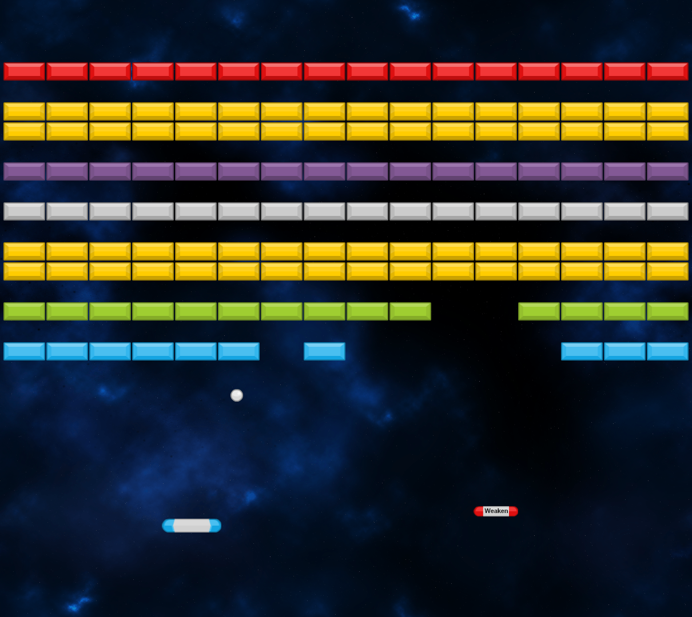
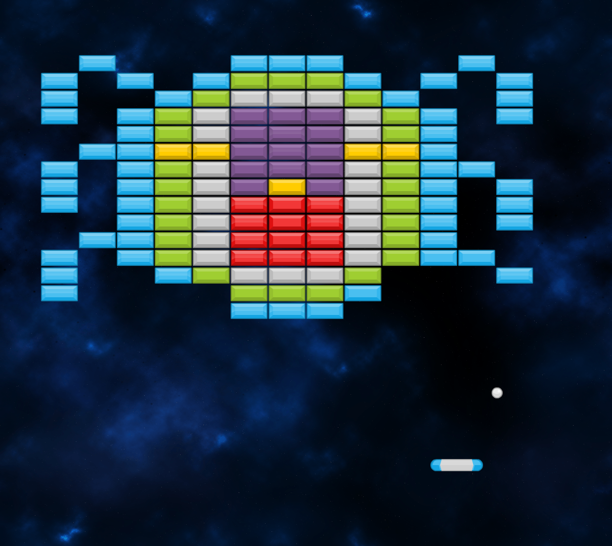
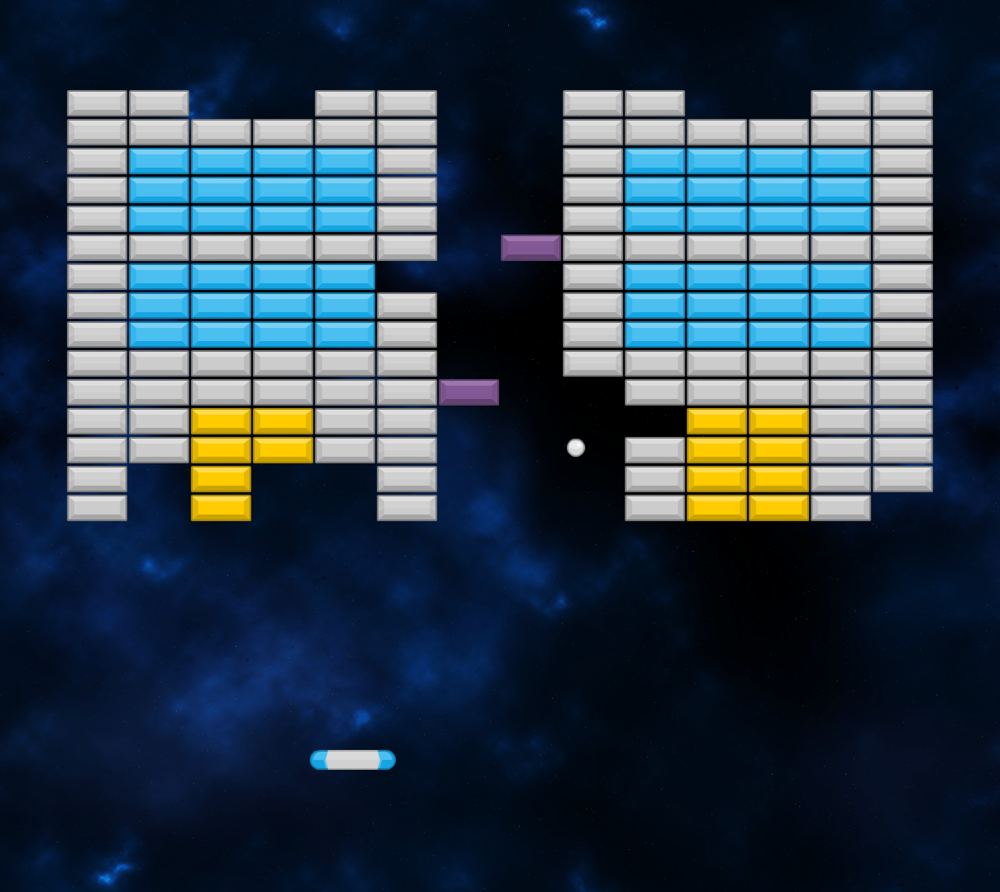

# Brick-Breaker
 An Arkanoid clone made in Godot with a level editor

Play the game here: https://sp4r0w.itch.io/brick-breaker

### About
-------------
This is my second project made in Godot v3.5.1. It's a clone of the popular Arkanoid game. It was made using C# and it features 10 different levels and the ability to create your own ones.   
It also features multiple powerups for the player to collect after destroying bricks. There are 3 types of bricks in the game, each behaving a little differently.  

#### WARNING !
Being my second C# game and me being more and more accustomed to Godot back then, the code wasn't that bad. Of course, it's not gonna be great, but I can definitely see improvement after Platformer.  
I did some small clean up and added comments but I haven't made any significant changes to the code.  
I uploaded this repo and preserved the game for me to look at how much I improve over time. Improving the code now, with my current knowledge defeats the point.  
However, you're free to improve upon this code if you wish to do so :)

### Getting Started
-------------
To compile this project, you will need at least Godot Mono v3.5.1. Do not forget you will need the required export templates.   
More in-depth guide is avaiable here: https://docs.godotengine.org/en/stable/tutorials/export/exporting_projects.html  
You're free to modify the project as you wish.

### Credits
-------------
Thanks to DipShtick (Varga) for testing.  
Graphical assets were made by Kenney (https://kenney.nl/)  
I also used Dynamic Space Background by DinVStudio (https://dinvstudio.itch.io/)  
Music was made by Of Far Different Nature (https://fardifferent.itch.io/)  
Sound effects were made by GameAudio (https://freesound.org/people/GameAudio/)  
Fonts used are Watermelon days by Khurasan and Poppins by Jonny Pinhorn.  

### Preview
-------------

Play the game here: https://sp4r0w.itch.io/brick-breaker
